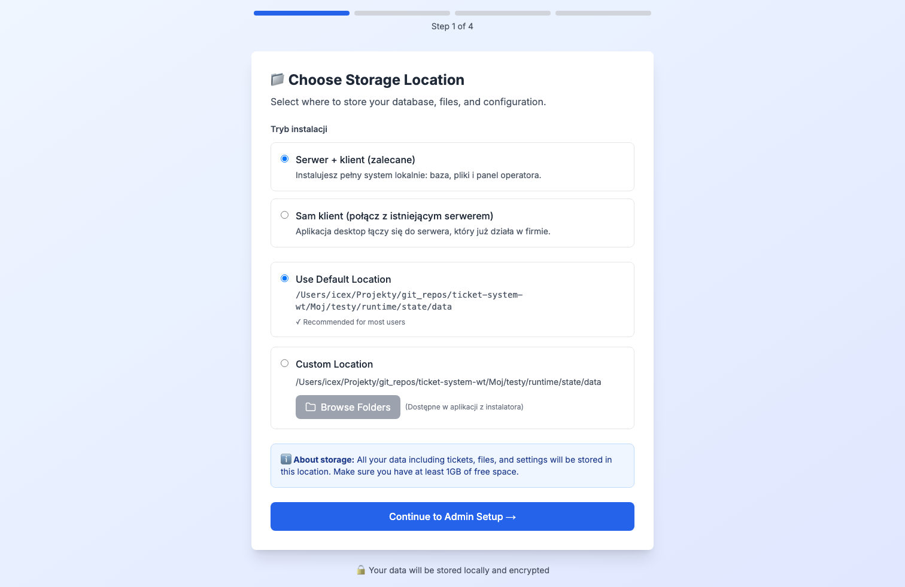
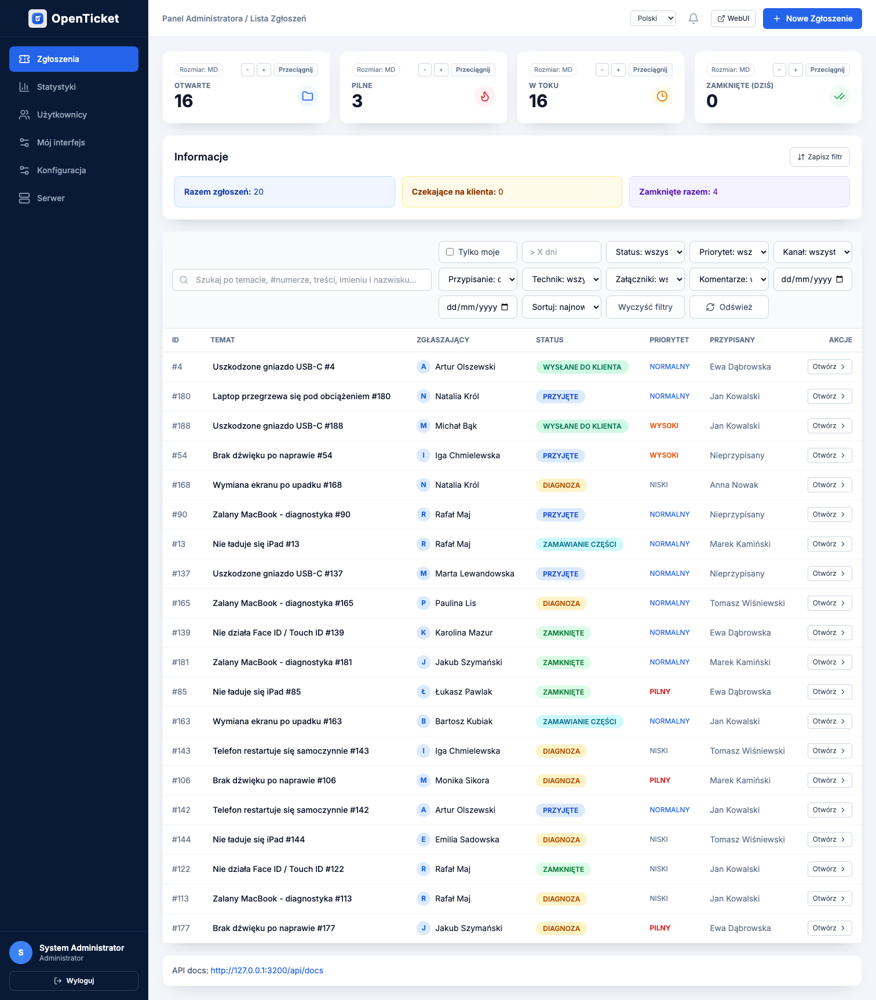
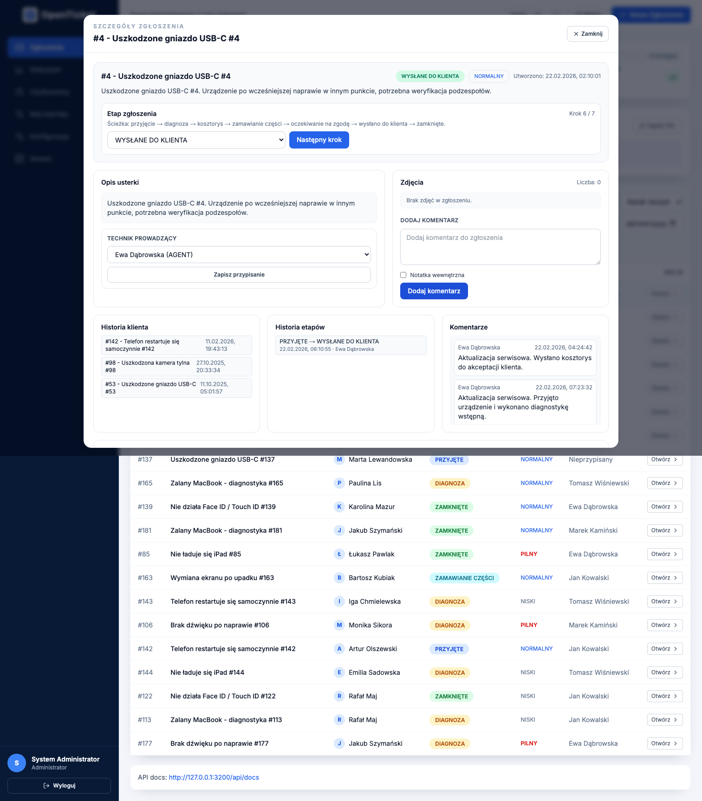
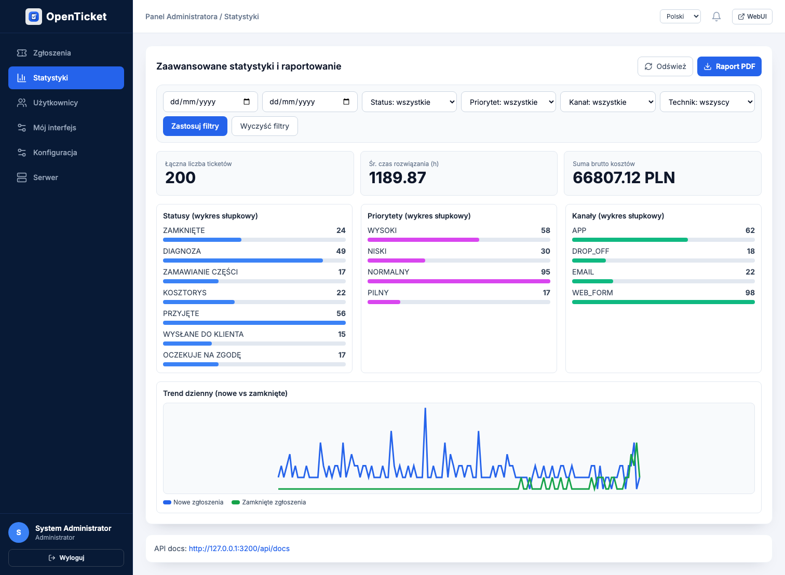
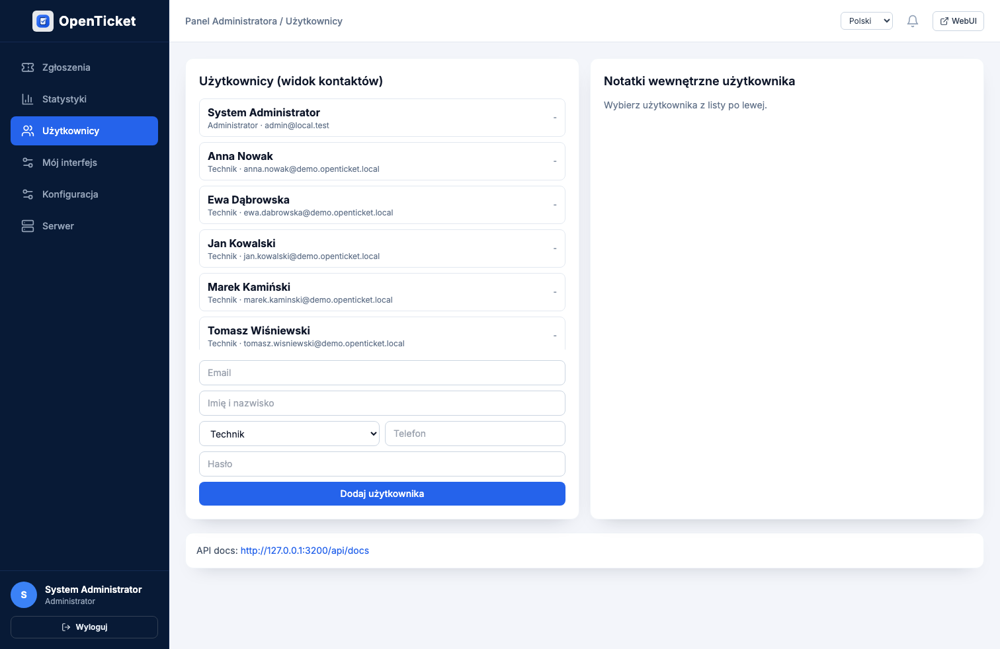
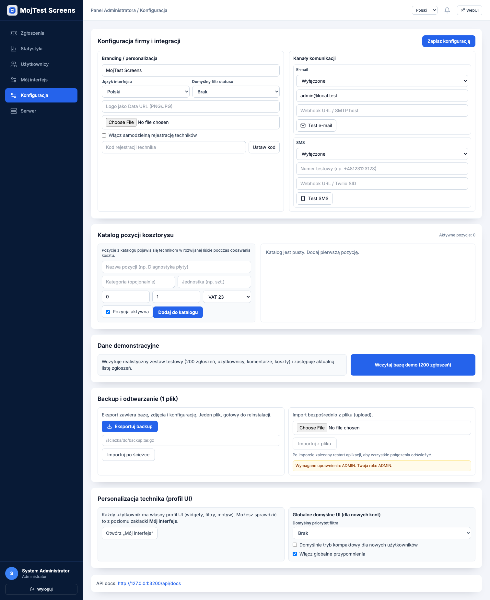
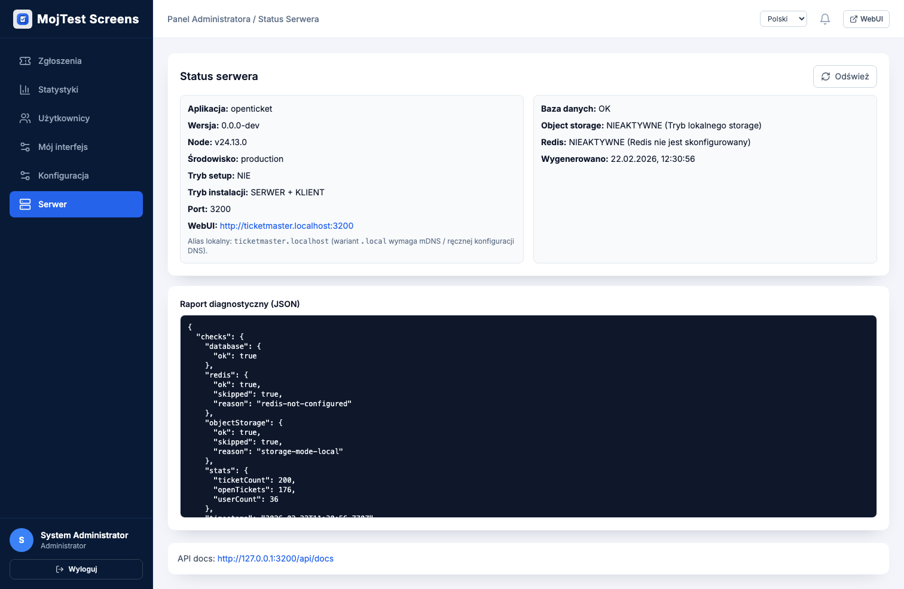
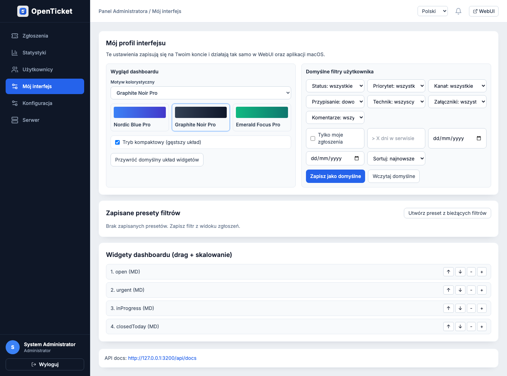
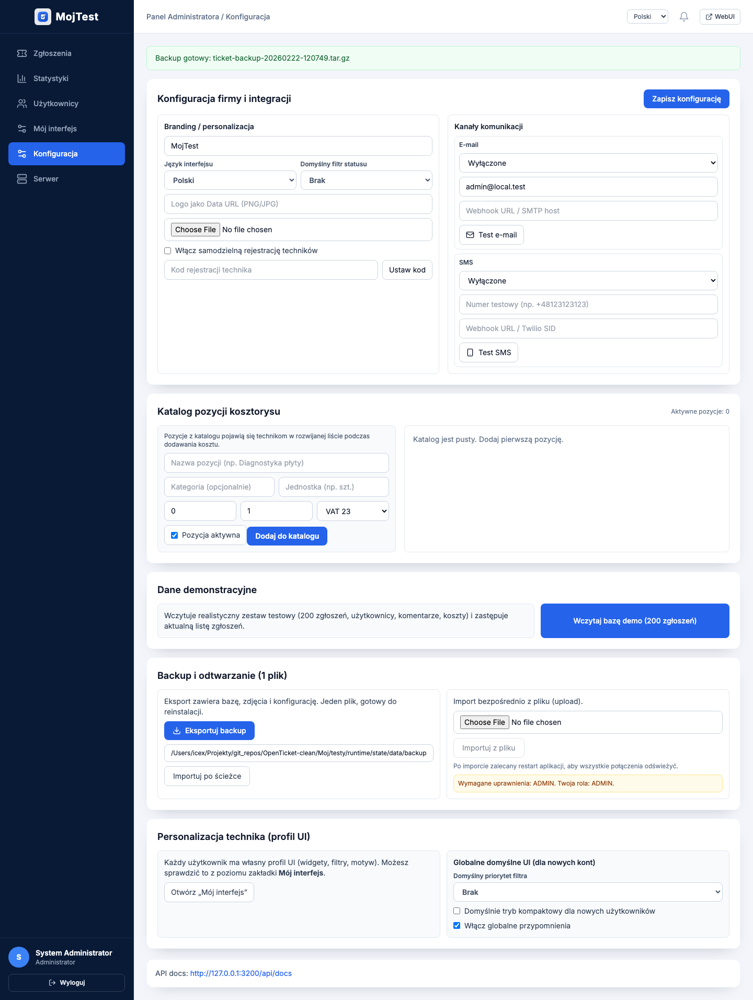

# OpenTicket (Local macOS + WebUI + iOS)

<!-- INSTALLER_LINK:START -->
## Installers (macOS + Windows)
- macOS PKG (latest): [OpenTicket-Installer.pkg](https://github.com/damianx9x/OpenTicket/releases/latest/download/OpenTicket-Installer.pkg)
- macOS PKG (v0.3.3): [OpenTicket-Installer.pkg](https://github.com/damianx9x/OpenTicket/releases/download/v0.3.3/OpenTicket-Installer.pkg)
- Windows EXE (latest): [OpenTicket-Installer.exe](https://github.com/damianx9x/OpenTicket/releases/latest/download/OpenTicket-Installer.exe)
- Windows EXE (v0.3.3): [OpenTicket-Installer.exe](https://github.com/damianx9x/OpenTicket/releases/download/v0.3.3/OpenTicket-Installer.exe)
<!-- INSTALLER_LINK:END -->

## GitHub Release Standard
- Każdy release ma tag semver (`v0.x.y`) i opis zmian w sekcji `Changelog`.
- README musi zawierać aktualne linki do `.pkg` i `.exe` w sekcji `Installers (macOS + Windows)`.
- Release musi zawierać metadane auto-update: `latest-mac.yml` (macOS) i `latest.yml` (Windows) oraz wskazane przez nie pliki binarne.
- Screenshoty UI dla release są w `docs/screenshots/v0.3/` i opisane w `docs/screenshots/README.md`.
- Przed publikacją uruchamiane są testy: `smoke`, `auth-smoke`, `ui-random-10` (Chromium + WebKit), `diagnose`.

Lokalny system ticketowy dla małego serwisu elektroniki:
- backend (NestJS + SQLite),
- WebUI (Next.js),
- aplikacja desktop (Electron),
- aplikacja iOS (SwiftUI),
- workflow QR/naklejki.

## Release 0.3.0 (stabilizacja + instalator produkcyjny)
Wersja `0.3.0` domyka krytyczny obszar „działa po instalacji”:
- pełny setup offline (server+client albo client-only),
- narzędzia ratunkowe na ekranie logowania desktop (status/restart/quick-repair/logi/diagnoza),
- kompletna deinstalacja z poziomu instalacji (`/Applications/Odinstaluj OpenTicket.command`),
- twarde testy regresji (`smoke`, `auth-smoke`, `client-only-smoke`, `ui-random-10`, `diagnose`),
- wersjonowanie pakietów backend/frontend/desktop do `0.3.0`.

## Lista zmian 0.3.0
- **Installer/Uninstaller**:
  - `.pkg` zawiera teraz pełny deinstalator i skróty uruchomienia deinstalacji,
  - deinstalator czyści aplikację, dane, cache, logi, launch agents i receipt-y `com.openticket.*` (oraz legacy `com.ticketsystem.*`).
- **Desktop recovery**:
  - login screen ma panel ratunkowy (status silnika, restart, quick-repair, otwarcie logów, raport JSON),
  - backend child-process ma dokładniejsze telemetry (`lastError`, `exitCode`, `runner`, `logFile`).
- **Bezpieczeństwo i uprawnienia**:
  - rejestracja technika usunięta z publicznego loginu,
  - `POST /api/v1/users/register-technician` wymaga roli `ADMIN`.
- **Rebranding OpenTicket**:
  - nazwa aplikacji desktop, bundle IDs i artefakty instalacyjne zmienione na `OpenTicket`,
  - setup i dashboard używają domyślnego brandingu `OpenTicket` (z możliwością nadpisania przez logo/nazwę firmy).
- **Uprawnienia UI (admin-only)**:
  - zakładki `Konfiguracja` i `Serwer` są ukryte dla ról innych niż `ADMIN`.
- **Nowe filtry serwisowe**:
  - `Tylko moje`,
  - `> X dni w serwisie`,
  - presety filtrów zapisywane per user (`uiPreferences`).
- **Demo danych 200 zgłoszeń**:
  - nowy endpoint `POST /api/v1/demo/load` (ADMIN),
  - przycisk w UI: `Wczytaj bazę demo (200 zgłoszeń)`.
- **Deterministyczne testy**:
  - `Moj/testy/ui-random-10.sh` sam wykrywa tryb `client_only` i wraca do świeżego `server_client`,
  - `Moj/testy/start.sh --fresh` zawsze wymusza reset nawet gdy backend już działa.
- **Dokumentacja i release assets**:
  - README rozszerzone o technologie, rozwiązania, galerię UI i changelog 0.3.0,
  - link do `.pkg` aktualizowany automatycznie przez `scripts/update-readme-installer-link.sh`,
  - screenshoty referencyjne dodane do `docs/screenshots/v0.3/`.

## Technologie i rozwiązania
- **Backend**: NestJS 10, Prisma ORM, SQLite runtime, API v1 (`/api/v1`), role-based auth (`ADMIN/AGENT/REPORTER/VIEWER`), rate limit + CORS + Helmet.
- **Frontend**: Next.js 14 (App Router), TypeScript, TailwindCSS, spójny klient API z obsługą kontraktu `data/meta/error`.
- **Desktop (macOS)**: Electron 27, backend uruchamiany jako child process (`electron-as-node`) z fallbackami, IPC do diagnostyki i napraw.
- **iOS (MVP scaffold)**: SwiftUI + LAN pairing/QR podpięte pod API.
- **Instalacja**: `pkgbuild` + `electron-builder`, bundlowany runtime (bez dociągania podczas install/run), oficjalny folder `Moj/` z installerem i deinstallerem.
- **Jakość**: Playwright (Chromium/WebKit), testy E2E flow, losowe akcje UI x10, raporty diagnostyczne i log bundle.

## Galeria UI (v0.3.0)
Setup:


Dashboard:


Popup zgłoszenia:


Statystyki:


Użytkownicy:


Konfiguracja:


Status serwera:


Mój interfejs (user profile):


Backup (sukces eksportu):


## Status repo i gałąź bazowa
- Repo robocze: bieżący checkout (`develop`)
- Źródło: [damianx9x/OpenTicket](https://github.com/damianx9x/OpenTicket)
- Gałąź bazowa: `master`
- Baseline: `docs/BASELINE.md`
- Status etapów: `docs/IMPLEMENTATION-STATUS.md`
- Mapowanie research -> wdrożenie: `docs/RESEARCH-ALIGNMENT.md`

## Quickstart (DEV)
```bash
cd <repo-root>
make smoke
cat .runtime/env
# użyj FRONTEND_PORT z .runtime/env
open http://127.0.0.1:3001
```
`make smoke` automatycznie podniesie usługi, jeśli backend nie działa.

## Oficjalna instalka/deinstalka (Moj)
```bash
cd <repo-root>
./Moj/build-oficjalna-instalka.sh
./Moj/install-local.sh
./Moj/deinstaluj-openticket.sh
```
- Artefakty instalacyjne: `Moj/OpenTicket-Installer.pkg` + `Moj/OpenTicket-Installer.dmg`
- Opis i kroki: `Moj/README.md`
- Jeśli miałeś błąd `spawn node ENOENT`, zainstaluj ponownie najnowszy `.pkg` z `Moj/` (stare paczki nie miały kompletnego runtime).
- Kreator setup (krok 1) ma teraz wybór:
  - `Serwer + klient` (pełna instalacja lokalna),
  - `Sam klient` (połączenie do istniejącego serwera, bez lokalnego setupu admina).
  - W trybie `Serwer + klient`: `Nowa baza`, `Import app.db` lub `Import backupu .tar.gz`.

## Test bez instalacji (`Moj/testy`)
```bash
cd <repo-root>
./Moj/testy/start.sh
./Moj/testy/start.sh --no-open
./Moj/testy/start.sh --fresh
./Moj/testy/open-fresh-browser.sh --reset-profile
./Moj/testy/smoke.sh
./Moj/testy/auth-smoke.sh
./Moj/testy/client-only-smoke.sh
./Moj/testy/ui-random-10.sh
./Moj/testy/ui-random-10.sh --all-browsers
./Moj/testy/modal-popup-smoke.sh
./Moj/testy/profile-ui-smoke.sh
./Moj/testy/backup-ui-smoke.sh
./Moj/testy/custom-path-backup-smoke.sh
./Moj/testy/setup-import-smoke.sh
./Moj/testy/fresh-10x-smoke.sh
./Moj/testy/capture-release-screenshots.sh
./Moj/testy/diagnose.sh
./Moj/testy/stop.sh
APP_ENV=DEV_LOCAL ./Moj/testy/reset.sh
```
- Jednorazowo dla testu `ui-random-10`:
```bash
npm --prefix frontend install --save-dev playwright
npx --prefix frontend playwright install chromium webkit
```
- To emuluje tryb „jak po instalacji” na `http://127.0.0.1:3200` (bez instalowania `.pkg`).
- `--fresh` resetuje dane testowe i zawsze uruchamia setup od początku.

## Diagnostyka
```bash
make diagnose
```
- Raport: `./.runtime/reports/diagnose-*.txt`
- Bundle: `./.runtime/reports/diagnose-*.tar.gz`
- Ręcznie:
```bash
./scripts/diagnose.sh --verbose
./scripts/diagnose.sh --bundle --open-mail twoj@email.pl
```

## Reset
Reset działa tylko w DEV:
```bash
APP_ENV=DEV_LOCAL make reset
```
Kasuje lokalny stan deweloperski z `./.runtime/state` i czyści procesy.

## Komendy (Makefile)
```bash
make up
make down
make reset APP_ENV=DEV_LOCAL
make diagnose
make test
make smoke
make stage3-test
make desktop-dev
make installer-official
make installer-official-win
make moj-testy-start
make moj-testy-smoke
make moj-testy-auth-smoke
make moj-testy-diagnose
make moj-testy-profile-ui-smoke
make moj-testy-backup-ui-smoke
make moj-testy-custom-path-backup-smoke
make moj-testy-setup-import-smoke
make moj-testy-fresh-10x-smoke
make moj-testy-stop
```
`make up` automatycznie wykrywa zajęte porty i przełącza się na wolne (zakres `+100`).
Windows local build alternatywnie: `powershell -ExecutionPolicy Bypass -File .\\Moj\\build-oficjalna-instalka-win.ps1`.

## Architektura (skrót)
- Backend: `backend/` (`/api/v1`, setup, tickets, diagnostics, QR)
- WebUI: `frontend/` (setup + dashboard)
- macOS app: `desktop/` (Electron uruchamia backend jako child process)
- iOS: `ios/SwiftUI/`
- Runtime DEV: `./.runtime/` (logi, pids, raporty, dane testowe)

## Standard logów
- Backend: `./.runtime/logs/backend.log`
- Frontend: `./.runtime/logs/frontend.log`
- Desktop: `./.runtime/logs/desktop.log`
- Bootstrap: `./.runtime/logs/bootstrap.log`

## Roadmap (Etapy)
- [x] Etap 0: stabilizacja checkoutu i baseline
- [x] Etap 1: naprawa krytycznych błędów backend build/API
- [x] Etap 2: `stop/reset/diagnose` + Makefile + smoke
- [x] Etap 3: pełna migracja UI z `strona-test` do głównego WebUI
- [~] Etap 4: desktop dev screen + narzędzia ratunkowe (mail diagnostyczny: TODO)
- [ ] Etap 5: iOS MVP (ticket + zdjęcia + pairing)
- [ ] Etap 6: QR podpisany + generator PDF naklejek
- [x] Etap 7: offline `.pkg` installer + deinstalator w pakiecie
- [ ] Etap 8: hardening (auth/rate-limit/CORS/CI gates)

## Postęp
### 2026-02-22 (release prep 0.3.3: ikona + filtry rozszerzone + katalog kosztów)
- Rebranding wizualny:
  - nowy zestaw ikon aplikacji (`desktop/assets/icon.png`, `desktop/assets/icon.ico`, `desktop/assets/icon.icns`) oraz generator ikon `scripts/generate-openticket-icons.py`,
  - nowy znak marki w WebUI: `frontend/public/openticket-mark.svg` (logowanie + fallback logo).
- Rozbudowane filtry ticketów (backend + frontend):
  - nowe kryteria: `kanał`, `przypisanie` (`assigned/unassigned`), `ma załączniki`, `ma komentarze`, `zakres dat od/do`, rozszerzone sortowanie (`status`, `numer`),
  - zapisywanie i szybkie przełączanie presetów filtrów użytkownika bez wychodzenia z dashboardu.
- Katalog pozycji kosztorysu:
  - nowe API: `GET/PUT /api/v1/settings/cost-catalog`,
  - panel admina do zarządzania pozycjami katalogu,
  - dropdown w formularzu kosztów z auto-uzupełnianiem `nazwa/kwota/VAT/ilość`.
- Motywy UI dopracowane pod profesjonalny wygląd:
  - `Helpdesk Blue`,
  - `Graphite Noir`,
  - `Emerald Flow`.
- Aktualizacja instalatora:
  - `.pkg` uruchamia setup assistant po instalacji (`--setup-assistant`),
  - `.exe` ma pełniejszą konfigurację skrótów i czyszczenie app data przy uninstall.
- Testy i walidacja:
  - `make test` = PASS,
  - `make stage3-test` = PASS (5/5),
  - `make moj-testy-smoke` = PASS,
  - `make moj-testy-auth-smoke` = PASS,
  - `make moj-testy-profile-ui-smoke` = PASS,
  - `make moj-testy-backup-ui-smoke` = PASS,
  - `make moj-testy-custom-path-backup-smoke` = PASS,
  - `make moj-testy-setup-import-smoke` = PASS,
  - `make moj-testy-fresh-10x-smoke` uruchomione 3 razy = `10/10 PASS` w każdej rundzie.

### 2026-02-22 (setup import existing DB + 10x fresh simulation)
- Setup (krok 1) dostał wybór źródła danych:
  - `Nowa baza (czysta instalacja)`,
  - `Import istniejącej bazy app.db`,
  - `Import backupu .tar.gz`.
- Dodano natywny wybór pliku w instalatorze desktop (`selectFile`): osobno dla `app.db` i `backup`.
- Backend setup (`/api/v1/setup/init`) obsługuje teraz:
  - `bootstrapMode=fresh|existing_db|backup_archive`,
  - `existingDatabasePath`,
  - `existingBackupArchivePath`,
  - oraz wykonuje migracje po imporcie.
- Backup export został utwardzony:
  - wykrywa aktywnie podpiętą bazę SQLite przez `PRAGMA database_list`,
  - lepiej radzi sobie z rozjazdem ścieżek po update/rebrandingu.
- UI/RBAC:
  - dla ról innych niż ADMIN wymuszony fallback na bezpieczne zakładki (bez `Konfiguracja` i `Serwer`),
  - formularze tworzenia/edycji użytkowników dostępne tylko dla ADMIN.
- Testy:
  - `./Moj/testy/setup-import-smoke.sh` = PASS (`existing_db` + `backup_archive`),
  - `./Moj/testy/smoke.sh` = PASS,
  - `./Moj/testy/backup-ui-smoke.sh` = PASS,
  - `./Moj/testy/profile-ui-smoke.sh` = PASS,
  - `./Moj/testy/ui-random-10.sh --all-browsers --fresh` = PASS,
  - 10x pętla fresh-start + random UI (10 akcji) = `10/10 PASS`.

### 2026-02-22 (fix: login/backup po setupie na niestandardowej ścieżce)
- Naprawiono krytyczny błąd po setupie z `~/Library/Application Support/...`:
  - `PrismaService` jest teraz reloadowalny (`refreshDatasource`) i po setupie przełącza się na nową bazę bez wymagania restartu aplikacji,
  - generowanie `DATABASE_URL` dla SQLite nie koduje już ścieżek w sposób powodujący problemy z przestrzeniami,
  - checkpoint WAL przy backupie używa bezpiecznego `queryRaw`.
- Uproszczono krok 1 setup:
  - dodano przycisk `Wykryj poprzednią bazę/backup`,
  - setup automatycznie skanuje popularne lokalizacje (`Application Support`, `Desktop`, `Downloads`) i pozwala wybrać znaleziony `app.db` lub `backup.tar.gz` jednym kliknięciem.
- Dodano test regresyjny:
  - `./Moj/testy/custom-path-backup-smoke.sh` (setup + login + backup na ścieżce z `Application Support`) = PASS.
- Dodano test stabilności:
  - `./Moj/testy/fresh-10x-smoke.sh` (10 pełnych cykli od zera) = PASS.
- Retest po poprawkach:
  - `./Moj/testy/smoke.sh` = PASS,
  - `./Moj/testy/setup-import-smoke.sh` = PASS,
  - `./Moj/testy/custom-path-backup-smoke.sh` = PASS,
  - `./Moj/testy/ui-random-10.sh --all-browsers --fresh` = PASS.

### 2026-02-21 (pełny debug + Windows installer + release automation)
- Przeprowadzono pełny retest aplikacji po zmianach UI/logiki i instalatorów:
  - `make test` = PASS,
  - `./Moj/testy/smoke.sh` = PASS,
  - `./Moj/testy/modal-popup-smoke.sh` = PASS,
  - `./Moj/testy/ui-random-10.sh` = PASS,
  - `./Moj/testy/auth-smoke.sh` = PASS,
  - `./Moj/testy/profile-ui-smoke.sh` = PASS,
  - `./Moj/testy/backup-ui-smoke.sh` = PASS,
  - `./Moj/testy/client-only-smoke.sh` = PASS.
- Dodano oficjalny build instalatora Windows:
  - `Moj/build-oficjalna-instalka-win.sh` (bash),
  - `Moj/build-oficjalna-instalka-win.ps1` (PowerShell),
  - artefakty: `Moj/OpenTicket-Installer.exe`, `Moj/OpenTicket-Portable.exe` + sumy SHA256.
- Uspójniono publikację release:
  - workflow GitHub publikuje instalatory macOS i Windows na tagach `v*`,
  - README ma automatyczny blok linków do `.pkg` i `.exe`.
- Dodano brakujące zasoby ikon aplikacji:
  - `desktop/assets/icon.icns`,
  - `desktop/assets/icon.ico`,
  - `desktop/assets/icon.png`.
- Usprawniono diagnostykę:
  - `scripts/diagnose.sh` ma fallback do logów `Moj/testy/runtime/logs`,
  - brakujące logi frontend/desktop są raportowane czytelnie jako `not found` (bez mylących stacktrace).

### 2026-02-21 (backup export fix + profil użytkownika UI)
- Naprawiono eksport backupu przy rozjazdach ścieżek po migracji/rebrandingu:
  - backend backupu wykrywa teraz dodatkowe legacy ścieżki danych (`ticket-system`, `TicketSystem`, `openticket-desktop`),
  - komunikat błędu dla `client_only` jest czytelny i prowadzi do backupu po stronie serwera,
  - endpoint backupu zwraca teraz listę sprawdzonych ścieżek przy błędzie.
- Dodano nową zakładkę użytkownika `Mój interfejs` (WebUI + macOS app):
  - wybór motywu (`Helpdesk Blue`, `Graphite Noir`, `Emerald Flow`),
  - tryb kompaktowy,
  - domyślne filtry użytkownika (`status`, `priorytet`, `tylko moje`, `> X dni`),
  - zarządzanie presetami filtrów (zastosuj/usuń).
- Dashboard widgety dostały realne sterowanie:
  - przeciąganie (drag & drop) do zmiany kolejności,
  - skalowanie widgetów (`SM/MD/LG`) z trwałym zapisem w preferencjach użytkownika.
- Rozszerzono opcje admina:
  - globalne domyślne UI dla nowych kont (domyślny priorytet filtra, compact mode),
  - przełącznik globalnych przypomnień.
- Testy po zmianach:
  - `npm --prefix backend run build` = PASS,
  - `npm --prefix frontend run build` = PASS,
  - `./Moj/testy/smoke.sh` = PASS,
  - `./Moj/testy/modal-popup-smoke.sh` = PASS,
  - `./Moj/testy/ui-random-10.sh` = PASS,
  - test klikalny Playwright: profil UI (persist motywu + compact) = PASS,
  - test klikalny Playwright: eksport backupu z `Konfiguracja` = PASS.

### 2026-02-21 (hotfix kliknięcia zgłoszenia + instalator 0.3.2)
- Naprawiono problem z otwieraniem szczegółów zgłoszenia po kliknięciu:
  - dodano jawny przycisk `Otwórz` w tabeli,
  - tytuł zgłoszenia jest osobnym klikalnym elementem (fallback dla środowisk, gdzie klik na cały `tr` bywa niestabilny).
- Uodporniono build instalatora:
  - `Moj/build-oficjalna-instalka.sh` buduje desktop do izolowanego outputu `desktop/release-user` (omija problem uprawnień po starych buildach root-owned).
- Podbito wersję aplikacji do `0.3.2` (`backend`, `frontend`, `desktop`).
- Przebudowano artefakty instalacyjne:
  - `Moj/OpenTicket-Installer.pkg`,
  - `Moj/OpenTicket-Installer.dmg`,
  - `Moj/OpenTicket-Installer.zip`,
  - sumy SHA256.
- Testy po hotfixie:
  - `./Moj/testy/smoke.sh` = PASS,
  - `./Moj/testy/modal-popup-smoke.sh` = PASS.

### 2026-02-21 (workflow etapów + reopen + statystyki z PDF)
- Dodano nowy workflow zgłoszenia (popup ticketu):
  - `PRZYJĘTE -> DIAGNOZA -> KOSZTORYS -> ZAMAWIANIE CZĘŚCI -> OCZEKUJE NA ZGODĘ -> WYSŁANE DO KLIENTA -> ZAMKNIĘTE`.
- Dodano sterowanie etapem:
  - rozwijane menu etapu,
  - przycisk `Następny krok`,
  - przycisk `Reopen (wznów zgłoszenie)` dla zgłoszeń zamkniętych.
- Historia zmian etapów jest teraz widoczna bezpośrednio w popupie (`Historia etapów`) i zapisywana przez backend (`ticket_status_history`).
- Przypisanie technika przeniesione do mniejszego, bocznego panelu nad historią etapów.
- Statystyki rozbudowane o:
  - filtry (od/do, status, priorytet, kanał, technik),
  - wykresy słupkowe (status/priorytet/kanał),
  - trend liniowy (nowe vs zamknięte),
  - eksport raportu do PDF (drukowalny widok `window.print`).
- Testy po wdrożeniu:
  - `npm --prefix backend run build` = PASS,
  - `npm --prefix frontend run build` = PASS,
  - `./Moj/testy/smoke.sh` = PASS,
  - `./Moj/testy/modal-popup-smoke.sh` = PASS,
  - `./Moj/testy/ui-random-10.sh` = PASS,
  - `./Moj/testy/capture-release-screenshots.sh` = PASS.

### 2026-02-21 (modal zgłoszenia + 3x praktyczny retest UI)
- Szczegóły zgłoszenia przeniesione do nowoczesnego popupu (overlay + animacje, `Esc`, klik poza okno).
- Dodano kontrolę niezapisanych zmian przy zamknięciu/przełączaniu zgłoszenia:
  - pytanie o zapis,
  - scenariusze: `zapisz`, `odrzuć`, `anuluj`.
- Dodano podgląd obrazów załączników bez wychodzenia z popupu.
- Dodano automatyczny test E2E popupu:
  - `Moj/testy/modal-popup-smoke.sh` (`save/discard/cancel`) = PASS.
- Dodano automatyczny generator screenshotów release:
  - `Moj/testy/capture-release-screenshots.sh`.
- Retest praktyczny 3x:
  - `./Moj/testy/ui-random-10.sh --all-browsers` uruchomione 3 razy = PASS (Chromium + WebKit),
  - `./Moj/testy/smoke.sh` = PASS,
  - `./Moj/testy/auth-smoke.sh` = PASS.

### 2026-02-21 (bezpieczne aktualizacje + backup przed update)
- Dodano mechanizm aktualizacji desktop (Electron) oparty o GitHub Releases:
  - check update / download / install z poziomu zakładki `Serwer`,
  - status aktualizacji live w UI (wersja, postęp, komunikaty, gotowość do instalacji).
- Dodano backup przed aktualizacją:
  - checkbox `Zrób backup bazy + zdjęć przed aktualizacją`,
  - ręczny przycisk `Backup teraz` + `Otwórz folder backupów`,
  - backup zawiera: `app.db`, `app.db-wal`, `app.db-shm`, `app.db-journal`, `uploads/`, `config.json`, `manifest.json`.
- Dodano automatyczny backup przy wykryciu nowej wersji aplikacji na starcie (przed uruchomieniem backendu/migracji).
- Ustawiono publikację auto-update w `desktop/package.json` (`build.publish -> GitHub OpenTicket`).
- Wzmocniono backup backendowy (`/api/v1/system/backup/export`):
  - checkpoint SQLite (best-effort),
  - eksport/odtwarzanie plików WAL/SHM/JOURNAL.
- Testy po zmianach:
  - `npm --prefix backend run build` = PASS,
  - `npm --prefix frontend run build` = PASS,
  - `npm --prefix desktop run build:electron` = PASS,
  - `./Moj/testy/smoke.sh` = PASS,
  - `./Moj/testy/auth-smoke.sh` = PASS.

### 2026-02-21 (hotfix setup/login + stabilność WebKit testów)
- Naprawiono krytyczny błąd po setupie (`P2021`, brak tabel po `setup/init` bez restartu):
  - `SetupService` wymusza refresh połączeń runtime Prisma przed resetem pliku sqlite i po zakończeniu setupu,
  - eliminuje przypadki `Internal server error` przy pierwszym logowaniu po konfiguracji.
- Potwierdzone funkcje operacyjne z ostatniego zakresu:
  - auto-tworzenie/powiązanie klienta przy przyjęciu zgłoszenia + historia klienta,
  - auto-przypisanie zgłoszenia do technika przyjmującego + ręczna zmiana przypisania,
  - dzwonek przypomnień z badge i szybkim przejściem do ticketu,
  - przycisk `WebUI` + alias `ticketmaster.localhost`,
  - przycisk `Wczytaj bazę demo (200 zgłoszeń)` dla admina.
- Poprawiono stabilność testów E2E:
  - `Moj/testy/ui-random-10.mjs` używa jednoznacznych selektorów menu sidebar (brak fałszywych FAIL w WebKit).
- Retest po zmianach:
  - `./Moj/testy/smoke.sh --no-fresh` = PASS,
  - `./Moj/testy/auth-smoke.sh --no-fresh` = PASS,
  - `./Moj/testy/ui-random-10.sh --all-browsers` = PASS,
  - test API (owner linkage + auto-assign + customer-history) = PASS,
  - `POST /api/v1/demo/load` (200 rekordów) = PASS.

### 2026-02-21 (flow zgłoszeń: klient+technik+przypomnienia)
- Ticket intake:
  - backend tworzy/powiązuje konto klienta (`REPORTER`) po e-mailu/telefonie, zamiast anonimowego wspólnego użytkownika,
  - kolejne zgłoszenia tego samego klienta wiążą się z tym samym kontem (`ownerUserId`), co daje historię.
- Przypisanie technika:
  - nowe zgłoszenie utworzone przez `ADMIN/AGENT` automatycznie przypisuje się do przyjmującego technika,
  - dodano ręczne przypisanie/odpięcie technika w dashboardzie (`Przypisanie technika` + zapis do backendu).
- Historia klienta:
  - nowy endpoint `GET /api/v1/tickets/:id/customer-history`,
  - panel „Historia klienta” w szczegółach ticketu z przejściem do poprzednich zgłoszeń.
- Przypomnienia UX:
  - globalny dzwonek z badge (`!` przy zaległych),
  - panel przypomnień z szybkim przejściem do ticketu.
- WebUI i alias:
  - nowy przycisk `WebUI` w headerze dashboardu,
  - otwiera adres aliasowy `http://ticketmaster.localhost:<port>` (bez dodatkowej konfiguracji DNS),
  - sekcja `Serwer` pokazuje aktywny URL WebUI i wyjaśnia różnicę `.localhost` vs `.local`.
- Narzędzia admina:
  - w zakładce `Serwer` (desktop) dodane szybkie akcje: restart silnika, szybka naprawa, otwarcie logów, raport diagnostyczny.
- Retest po zmianach:
  - `npm --prefix backend run build` = PASS,
  - `npm --prefix frontend run build` = PASS,
  - `npm --prefix desktop run build:electron` = PASS,
  - testy Playwright (logowanie, przypisanie, historia klienta, dzwonek przypomnień, WebUI, demo button) = PASS.

### 2026-02-21 (hotfix backup export v0.3.1)
- Naprawiono błąd eksportu backupu:
  - eksport używa aktywnie używanej ścieżki runtime DB (zamiast wyłącznie starego `dataPath` z configu),
  - poprawiony import backupu przy reinstalacji i zmianie lokalizacji danych,
  - zabezpieczone nadpisywanie configu po imporcie (utrzymanie poprawnych lokalnych ścieżek).
- Opublikowano nowy instalator:
  - release: `v0.3.1`,
  - artefakty: `.pkg`, `.dmg`, `.zip`, `*.sha256`.

### 2026-02-21 (stabilność długoterminowa: silnik + baza)
- Dodano cykliczny monitoring zdrowia backendu w desktop (`watchdog-health`):
  - jeśli proces żyje, ale healthcheck/DB przestają działać, desktop po 3 kolejnych błędach wykonuje auto-restart silnika,
  - monitor działa co 15s i nie koliduje z setupem ani ręcznym restartem.
- Potwierdzono naprawę błędu startu instalacji `spawn node ENOENT` na paczce produkcyjnej:
  - backend uruchamia się przez `electron-as-node`,
  - start pakietowanej `OpenTicket.app` -> backend gotowy, brak `ENOENT` w logach.
- Retest po zmianach:
  - `./Moj/testy/smoke.sh --no-fresh` = PASS,
  - `./Moj/testy/auth-smoke.sh --no-fresh` = PASS,
  - `node ./Moj/testy/ui-random-10.mjs --browser chromium` = PASS,
  - `node ./Moj/testy/ui-random-10.mjs --browser webkit` = PASS,
  - przebudowa instalatora `./Moj/build-oficjalna-instalka.sh` = PASS.

### 2026-02-21 (stabilność logowania + reset bazy po instalacji)
- Naprawiono źródło błędu `Internal server error` przy logowaniu:
  - mapowanie błędów Prisma/SQLite do czytelnych komunikatów (`503` zamiast anonimowego `500`),
  - automatyczne przejście do `setupMode` gdy konfiguracja wskazuje nieistniejącą lub niedostępną bazę SQLite.
- Uodporniono start backendu na środowisko desktop:
  - Prisma CLI uruchamiane przez `process.execPath` + `prisma/build/index.js` (eliminuje problemy typu `env: node: No such file or directory`).
- Dodano pełny reset „od zera” w aplikacji desktop:
  - nowe IPC `factory-reset`,
  - przycisk na ekranie logowania `Reset systemu (setup od nowa)` kasuje config + DB + uploady i restartuje silnik.
- Dodano watchdog silnika backendu:
  - automatyczny restart po awarii procesu (z limitem prób),
  - komunikat watchdoga trafia do UI logowania.
- Naprawiono walidację „starego configu” przy starcie desktop:
  - konfiguracja nie jest już kasowana błędnie przy customowej lokalizacji danych.
- Testy po poprawkach:
  - `./Moj/testy/smoke.sh` = PASS,
  - `./Moj/testy/auth-smoke.sh --no-fresh` = PASS,
  - `./Moj/testy/ui-random-10.sh --fresh` = PASS,
  - test awaryjny `stale config -> missing db` = backend startuje w `setupMode=true` (bez 500),
  - `npm --prefix backend run build`, `npm --prefix frontend run build`, `npm --prefix desktop run build:electron` = PASS.

### 2026-02-21 (deep debug + release 0.3.0)
- Wykonano pełny retest end-to-end:
  - `make test`,
  - `./Moj/testy/smoke.sh`,
  - `./Moj/testy/auth-smoke.sh`,
  - `./Moj/testy/client-only-smoke.sh`,
  - `./Moj/testy/ui-random-10.sh --all-browsers --fresh`,
  - `./Moj/testy/diagnose.sh`.
- Wszystkie powyższe testy zakończone `PASS`.
- Wzmocniono skrypty testowe przed race-condition:
  - lock runtime dla `Moj/testy/start.sh` i `Moj/testy/reset.sh`,
  - lepsza obsługa PID/lock (mniej fałszywych błędów przy równoległych uruchomieniach).
- Zaktualizowano build instalatora:
  - paczki `.pkg/.dmg/.zip` przebudowane dla `0.3.0`,
  - payload `.pkg` zweryfikowany pod obecność deinstalatora i skrótów uninstall.
- Uwaga release:
  - paczka `.pkg` jest buildem lokalnym bez podpisu Apple Developer ID (do testów lokalnych i pilotażu),
  - podpis/notaryzacja to osobny krok release-time.

### 2026-02-20
- Odtworzono działający checkout z niestandardowego bare repo.
- Naprawiono backend compile blockers (`tickets.service`, DTO i relacje Prisma/SQLite).
- Dodano brakujące moduły API (`qrcode`, `provision`, `pairings`).
- Dodano endpointy:
  - `GET /api/v1/health`
  - `GET /api/v1/system/info`
  - `GET /api/v1/diagnostics/report`
  - `POST /api/v1/tickets/:id/qr`
  - `POST /api/v1/qr/scan`
- Ujednolicono bazowy kontrakt odpowiedzi przez globalny interceptor API.
- Naprawiono IPC kompatybilność `window.electron` vs `window.electronAPI`.
- Dodano skrypty operacyjne:
  - `scripts/up.sh`
  - `scripts/stop.sh`
  - `scripts/reset.sh`
  - `scripts/diagnose.sh`
  - `scripts/smoke.sh`
- Dokończono Etap 3:
  - jeden klient API z poprawnym odpakowaniem `data/meta`,
  - dashboard WebUI działa na realnym API (ticket + komentarz + koszt),
  - usunięto krytyczne blokery DTO (`ticketId` z URL) i auto-seed stawek VAT.
- API ticketów/komentarzy/kosztów jest teraz chronione tokenem i rolami (admin/technik/reporter/viewer).
- Setup po inicjalizacji wykonuje auto-logowanie admina i przechodzi bezpośrednio do dashboardu (fallback: ekran logowania).
- Wzmocniono kompatybilność Safari/WebKit przez bezpieczne operacje localStorage (bez crash przy restrykcyjnych ustawieniach prywatności).
- Konfiguracja firmy dostała upload logo z podglądem oraz testy kanałów e-mail/SMS z widocznym wynikiem.
- Desktop backend runner ma wielowarstwowy fallback (`electron-as-node` + opcjonalnie system node), co usuwa błąd `spawn node ENOENT` w paczkach klientowych.
- Dodano automatyczny test „10 losowych akcji menu” z raportem JSON i screenshotem w razie awarii (`Moj/testy/ui-random-10.sh`).
- Dodano folder `Moj/` z oficjalnym workflow testowym:
  - `Moj/build-oficjalna-instalka.sh`
  - `Moj/install-local.sh`
  - `Moj/deinstaluj-openticket.sh`
  - gotowe artefakty `.pkg/.dmg/.zip` + sumy SHA256.
- Naprawiono runtime instalatora macOS:
  - usunięty błąd `Failed to start backend: spawn node ENOENT`,
  - backend w paczce startuje przez `process.execPath` + `ELECTRON_RUN_AS_NODE`,
  - backend/frontend bundlowane jako `extraResources` w `.app`.
- Dodano `Moj/testy/` do testów bez instalacji (`start/stop/reset/diagnose/smoke`).
- Naprawiono routing statycznego WebUI w backendzie (`/setup`, `/dashboard`):
  - usunięte `404 Cannot GET /setup`,
  - usunięta pętla ekranu `Loading OpenTicket...`.
- `Moj/testy/start.sh` automatycznie przebudowuje backend/frontend, gdy kod źródłowy jest nowszy od artefaktów build.
- Dodano tryb restartu setup bez terminalowej ręcznej diagnostyki:
  - `./Moj/testy/start.sh --fresh`,
  - przycisk „Reset konfiguracji (DEV) i uruchom setup” na ekranie `/setup` gdy system jest już skonfigurowany.
- Naprawiono błąd setup kroku 3 (`Prisma db push failed: Schema engine error`):
  - stabilizacja `db push` (retry + fallback URL wariantów),
  - lepsza obsługa ścieżek DB i resetu DEV.
- Naprawiono build CSS WebUI dla pakietu statycznego:
  - dodany `frontend/tailwind.config.js` z poprawnym `content`,
  - dashboard ma styl jak demo także po buildzie offline (`frontend/out`).
- Dopracowano dashboard pod wygląd demo (1:1 baza):
  - sidebar/topbar/karty/tabela jak w referencji,
  - domyślnie brak dolnego panelu szczegółów (pojawia się po wyborze ticketu),
  - zachowane animacje wejścia sekcji.
- Wzmocniono testy „jak pierwszy start klienta”:
  - `Moj/testy/reset.sh` czyści także cache builda (`frontend/.next`, `frontend/out`, `backend/dist`),
  - `Moj/testy/smoke.sh` domyślnie uruchamia `fresh` reset/start,
  - dodano izolowany profil przeglądarki: `Moj/testy/open-fresh-browser.sh --reset-profile`.
- Dla Safari dodano twardą politykę `no-store` dla statycznych zasobów serwowanych przez backend.
- Usunięto globalny fallback CSS z layoutu, który zniekształcał UI względem demo (szczególnie sidebar/menu).
- Ujednolicono konfigurację Tailwind (`tailwind.config.ts` + `tailwind.config.js`) aby build był deterministyczny.
- Setup ma dodatkowy fallback migracji SQLite uruchamiany in-process (bez zależności od `prisma db push` i `sqlite3` binarki).
- W trybie desktop/testowym setup używa teraz `TICKET_SYSTEM_FORCE_SQLITE_FALLBACK=1`, co eliminuje błąd kroku 3 (`Schema engine error`) w konfiguracjach klientowych.
- Potwierdzony rendering WebUI na silniku WebKit (Safari-like):
  - `output/playwright/setup-webkit.png`
  - `output/playwright/dashboard-webkit.png`
- Dodano timeout dla zapytań API po stronie WebUI (`frontend/lib/api-base.ts`, domyślnie `12000ms`) i `cache: no-store`, żeby Safari/WebKit nie zawieszał się na ekranie `Ładowanie dashboardu...`.
- Retest po poprawce:
  - `./Moj/testy/smoke.sh` = PASS (5/5),
  - WebKit screenshot po setupie i wejściu na dashboard:
    - `output/playwright/dashboard-webkit-after-fix.png`.
- Po setupie działa auto-logowanie admina:
  - przycisk `Przejdź do dashboardu` przechodzi od razu do zalogowanego `/dashboard` (bez ręcznego logowania).
- Potwierdzone zabezpieczenie endpointów ticketów:
  - bez tokenu `GET /api/v1/tickets` => `401`,
  - z tokenem admina `GET /api/v1/tickets` => `200`.
- Test losowych akcji menu:
  - `./Moj/testy/ui-random-10.sh --all-browsers` = `PASS` dla Chromium i WebKit,
  - raporty: `Moj/testy/runtime/reports/ui-random-10-*-PASS-*.json`.
- Test uruchomienia gotowej paczki `.app`:
  - backend startuje przez `electron-as-node`,
  - błąd `spawn node ENOENT` nie występuje.

### 2026-02-21
- Setup lokalizacji danych został utwardzony:
  - nowy endpoint `POST /api/v1/setup/validate-path`,
  - walidacja uprawnień zapisu + czytelny komunikat o błędzie,
  - brak przerywającego popupu w trybie przeglądarki (czytelny fallback tekstowy).
- Zgodnie z analizą `NOTATKA_BADANIA_TICKETING_2026-02-20.md` wdrożono kolejne twarde punkty bezpieczeństwa:
  - `helmet` (nagłówki bezpieczeństwa),
  - CORS allowlist (localhost/LAN + konfiguracja env),
  - rate limiting na `auth/login`, `setup/*`, `tickets/status/:token`,
  - diagnostyka (`/api/v1/diagnostics*`) tylko dla `ADMIN`,
  - załączniki wymagają auth + role + walidacja MIME/rozszerzeń/limitu rozmiaru.
- Naprawiono „martwy” przycisk powiadomień w dashboardzie (ma realną akcję i przejście do konfiguracji).
- Dodano auto-migrację Prisma przy starcie backendu (`TICKET_SYSTEM_AUTO_MIGRATE=1`), żeby upgrade nie kończył się błędem brakującej kolumny.
- Skrypty operacyjne zostały domknięte pod deterministykę:
  - `scripts/up.sh` uruchamia backend w `APP_ENV=DEV_LOCAL` + `TICKET_SYSTEM_ALLOW_DEV_RESET=1`,
  - `scripts/up.sh` startuje backend stabilnie z `node backend/dist/main.js` (auto-build, bez niestabilnego `ts-node-dev`),
  - `scripts/smoke.sh` domyślnie działa w trybie `fresh` i zawsze odtwarza znany stan testowy,
  - `scripts/smoke.sh` auto-startuje usługi, gdy backend jest wyłączony (`SMOKE_AUTO_UP=1`),
  - `scripts/diagnose.sh` próbuje autoryzowanego reportu diagnostycznego.
- Rebuild instalatora po poprawkach:
  - `Moj/OpenTicket-Installer.pkg`,
  - `Moj/OpenTicket-Installer.dmg`,
  - `Moj/OpenTicket-Installer.zip`,
  - odświeżone sumy SHA256.
- Real-life testy po poprawkach:
  - `make smoke` (bez wcześniejszego `make up`) = PASS,
  - `make up && make smoke && make diagnose && make down` = PASS,
  - `./Moj/testy/smoke.sh --no-fresh` = PASS,
  - `./Moj/testy/auth-smoke.sh --no-fresh` = PASS,
  - `./Moj/testy/ui-random-10.sh --all-browsers` = PASS (Chromium + WebKit),
  - test fallbacku wyboru folderu w przeglądarce: brak popupu, poprawny komunikat inline.
- Domknięto brakujące elementy dashboardu zgłoszone przez użytkownika:
  - działający upload zdjęć/PDF do zgłoszeń (nowe zgłoszenie + istniejący ticket),
  - lista załączników z akcjami `Otwórz` i `Usuń`,
  - przypomnienia ticketowe (dodaj/wykonane/wznów/usuń),
  - zakładka `Serwer` (status + raport diagnostyczny JSON),
  - edycja użytkownika (e-mail, imię, rola, telefon, hasło, blokada konta),
  - live branding (logo + nazwa firmy) widoczne natychmiast po zapisie konfiguracji,
  - przełącznik języka PL/EN (header + mapowanie statusów/priorytetów/nav).
- Poprawiono wyszukiwarkę ticketów:
  - backend filtruje po `tytule`, `#numerze`, `opisie`, `imieniu`, `nazwisku`, `mailu`, komentarzach.
- Urealniono feedback instalacji/setup:
  - krok 3 setup ma teraz pasek postępu i etapy inicjalizacji zamiast samego spinnera.
- Zaktualizowano testy `Moj/testy/ui-random-10`:
  - usunięto twarde założenie o napisie `HELPDESK` (branding jest dynamiczny),
  - selektor wyszukiwarki zgodny z aktualnym placeholderem.
- Utwardzono UX importu backupu:
  - import z pliku wymaga teraz jawnego przycisku `Importuj z pliku` (nie auto-start po samym wyborze),
  - widoczna jest aktualna rola zalogowanego konta przy sekcji backupu,
  - przy błędzie `403` komunikat pokazuje rolę użytkownika, co skraca diagnostykę problemu „jestem adminem, ale import nie działa”.
- Dodano tryby instalacji w setup wizardzie:
  - `server_client` (lokalny serwer + klient),
  - `client_only` (sam klient, URL istniejącego serwera).
- Dla trybu `client_only` dodano automatyczne wykrywanie serwera:
  - `POST /api/v1/setup/discover-servers` (auto-skan LAN, szybki i pełny),
  - `POST /api/v1/setup/validate-remote` (walidacja ręcznie wpisanego URL, także zewnętrznego),
  - UI setup pokazuje wykryte serwery i pozwala wybrać je 1 kliknięciem.
- Dodano endpoint setup:
  - `POST /api/v1/setup/client-only`
  - `POST /api/v1/setup/status` zwraca teraz także `installationMode` i `remoteApiBaseUrl`.
- Aplikacja automatycznie stosuje bazę API dla trybu `client_only` (przekierowanie do logowania bez uruchamiania lokalnego setupu admina).
- Real-life retest po wdrożeniu powyższych zmian:
  - `./Moj/testy/smoke.sh` = PASS,
  - `./Moj/testy/client-only-smoke.sh` = PASS,
  - `./Moj/testy/auth-smoke.sh` = PASS,
  - `./Moj/testy/ui-random-10.sh --all-browsers` = PASS (Chromium + WebKit),
  - manualny test Playwright: setup 1→4, logowanie admina, tworzenie ticketu ze zdjęciem, przypomnienia, export/import backupu, podmiana logo, zakładka serwera, przełącznik języka.
- Naprawiono fałszywe błędy w zakładce `Serwer`:
  - diagnostyka nie próbuje już na siłę Redis/S3 w trybie lokalnym,
  - Redis i Object Storage są oznaczane jako `NIEAKTYWNE`, gdy nie są skonfigurowane,
  - usunięto spam logów ioredis (`Unhandled error event`) podczas odświeżania statusu.
- Logowanie zostało uproszczone i utwardzone:
  - usunięto publiczną rejestrację technika z ekranu `/login`,
  - rejestracja technika jest dostępna dopiero po zalogowaniu (panel `Użytkownicy` / admin),
  - endpoint `POST /api/v1/users/register-technician` wymaga teraz roli `ADMIN`.
- Ekran logowania w aplikacji desktop ma teraz narzędzia serwisowe:
  - `Odśwież status silnika`,
  - `Restart silnika`,
  - `Szybka naprawa` (restart + healthcheck),
  - `Otwórz logi`,
  - `Zapisz raport diagnostyczny` do pliku JSON.
- Instalator `.pkg` zawiera teraz kompletny deinstalator:
  - instalowany plik: `/Applications/Odinstaluj OpenTicket.command`,
  - alias EN: `/Applications/Uninstall OpenTicket.command`,
  - właściwy skrypt: `/Library/Application Support/OpenTicket/uninstall-openticket.sh`,
  - usuwa aplikację, dane, cache, logi, launch agents oraz receipt-y pakietu.
- Retest po wdrożeniu narzędzi serwisowych:
  - `npm --prefix backend run build` = PASS,
  - `npm --prefix frontend run build` = PASS,
  - `npm --prefix desktop run build` = PASS,
  - `./Moj/testy/smoke.sh` = PASS,
  - `./Moj/testy/auth-smoke.sh` = PASS,
  - `./Moj/testy/client-only-smoke.sh` = PASS,
  - `./Moj/testy/ui-random-10.sh --all-browsers` = PASS.

### Wynik testów Etap 1 (backend/API)
- `T1_build=PASS`
- `T2_health=PASS`
- `T3_create=PASS`
- `T4_list_meta=PASS`
- `T5_diag_db=PASS`

### Wynik testów Etap 2 (start/stop/reset/diagnose)
- `T1_up_health=PASS`
- `T2_down_releases_ports=PASS`
- `T3_reset_block_non_dev=PASS`
- `T4_reset_dev_reinit=PASS`
- `T5_setup_after_reset=PASS`

### Wynik testów Etap 3 (WebUI↔API)
- `T1_front_dashboard=PASS`
- `T2_create_ticket=PASS`
- `T3_add_comment=PASS`
- `T4_add_cost=PASS`
- `T5_list_ticket_meta=PASS`

## Jak testować (5x go/no-go po wdrożeniu)
```bash
make test
make up
make smoke
make diagnose
make down
```
Warunek przejścia: wszystkie 5 kroków przechodzą bez błędu.

## Znane problemy
- Część starych dokumentów opisuje nieaktualne porty (`3333`, `3002`).
- `frontend/strona-test` to legacy demo i nie jest używany przez produkcyjny flow.
- iOS i desktop mają jeszcze część endpointów tymczasowych do dopracowania.
- W środowisku zewnętrznym (narzędzia CI/agent) procesy dev mogą być ubijane po zakończeniu pojedynczego kroku; lokalnie uruchamiaj normalnie przez `make up`.
- Safari/WebKit przy bardzo pierwszym wejściu po `--fresh` może pokazać ekran ładowania przez kilka sekund, zanim dociągnie pierwszy zestaw danych.

## Szybkie naprawy (UI/Setup)
- Gdy setup nie chce się ponownie otworzyć (system już skonfigurowany):
```bash
./Moj/testy/start.sh --fresh
```
- Gdy setup zatrzymuje się na kroku 3 (`Schema engine error`):
```bash
./Moj/testy/start.sh --fresh --no-open
./Moj/testy/open-fresh-browser.sh --reset-profile
```
- Gdy UI wygląda „pusto” / bez styli:
```bash
APP_ENV=DEV_LOCAL ./Moj/testy/reset.sh
./Moj/testy/start.sh --fresh --no-open
./Moj/testy/open-fresh-browser.sh --reset-profile
```
  Dodatkowo odśwież stronę twardo (`Cmd+Shift+R`).

## Następne kroki
1. Etap 4: dodać wysyłkę diagnostyki e-mailem z desktop (screen ratunkowy już wdrożony).
2. Etap 5: domknąć iOS MVP (ticket + zdjęcia + QR flow).
3. Etap 6: podpisany QR + generator PDF naklejek + minimalny auth.

## Changelog
- `2026-02-22`: release prep `0.3.3` (nowa ikona OpenTicket, rozszerzone filtry ticketów + szybkie presety, katalog pozycji kosztorysu z auto-uzupełnianiem, dopracowane motywy UI, rebuild instalatorów macOS/Windows i potrójny deep smoke `fresh-10x`).
- `2026-02-21`: bezpieczny mechanizm aktualizacji desktop (check/download/install), backup przed aktualizacją (DB+WAL+uploads+config), automatyczny backup przy zmianie wersji, publish config pod GitHub Releases.
- `2026-02-21`: hotfix setup/login po inicjalizacji (refresh połączeń Prisma; koniec błędów `P2021` po `setup/init`) + poprawka selektorów random UI testów dla WebKit.
- `2026-02-21`: release `0.3.0` (backend/frontend/desktop), kompletny deinstalator w instalatorze `.pkg`, narzędzia ratunkowe na loginie desktop, poprawa deterministyczności `Moj/testy/ui-random-10` i `Moj/testy/start.sh`, pełny retest go/no-go.
- `2026-02-20`: stabilizacja repo, naprawa backendu i narzędzi diagnostycznych (Etap 0-2), testy 5/5 dla Etap 1 i 2.
- `2026-02-20`: domknięcie Etapu 3 (WebUI↔API) + folder `Moj` z oficjalnym installer/uninstaller.
- `2026-02-21`: domknięcie brakujących funkcji dashboardu (załączniki, przypomnienia, status serwera, edycja użytkownika, PL/EN, live logo), poprawa testów random UI i pełny retest Chromium/WebKit.
- `2026-02-21`: pełny debug zakładki `Serwer` i poprawka diagnostyki lokalnej (Redis/S3 = `NIEAKTYWNE`, brak fałszywych błędów).
