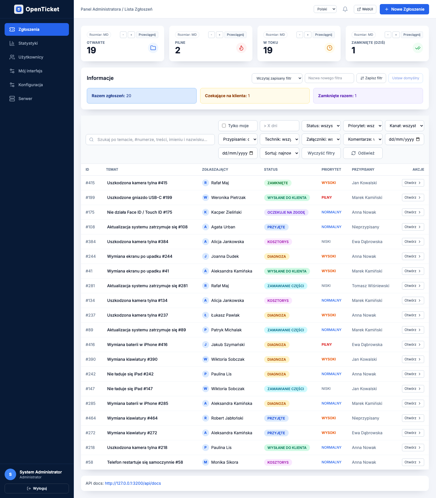
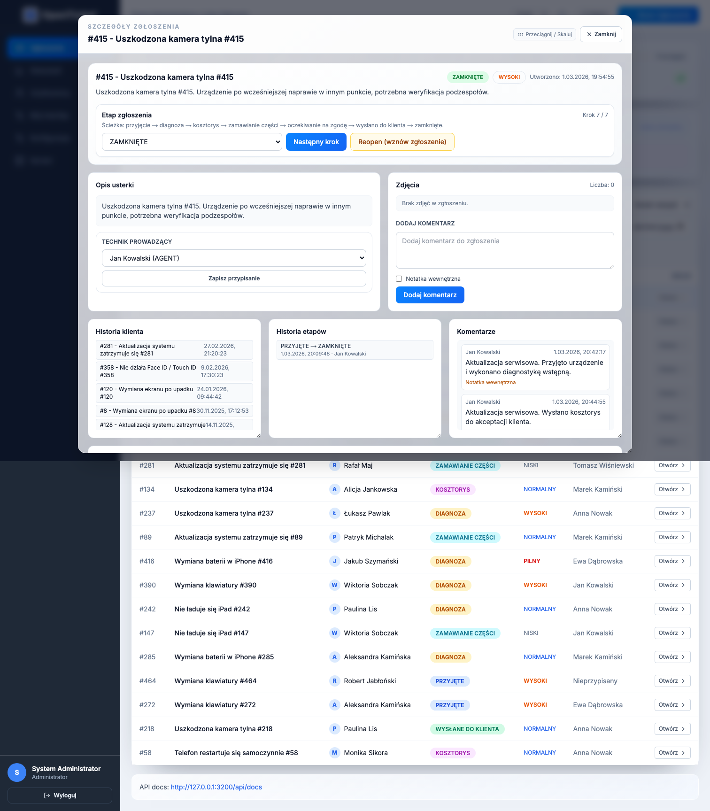
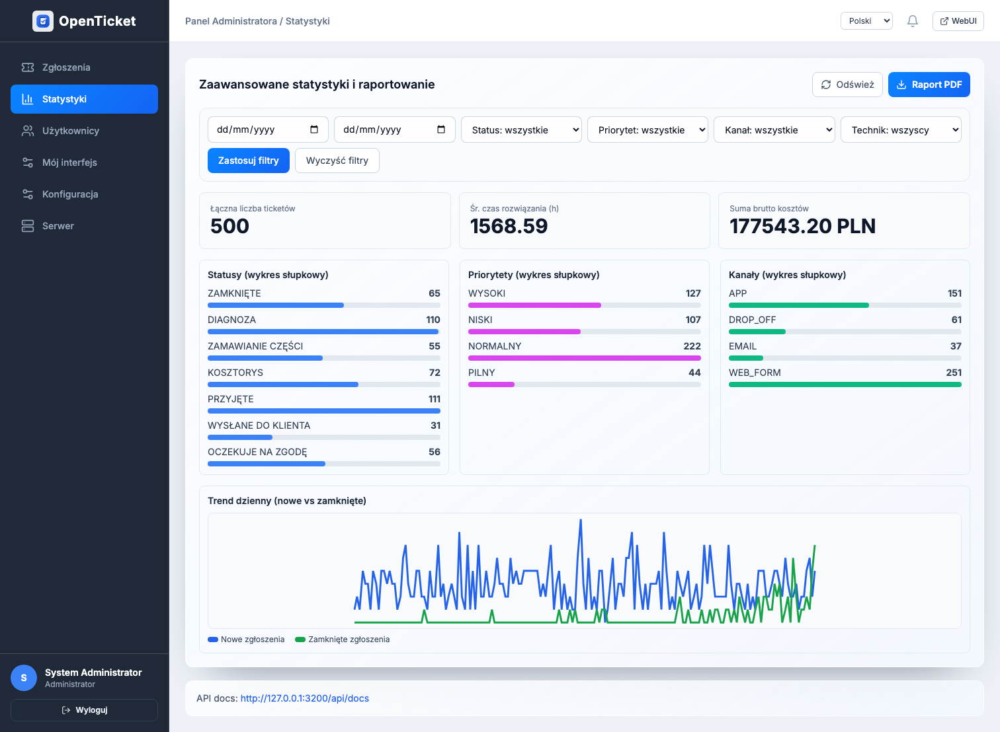
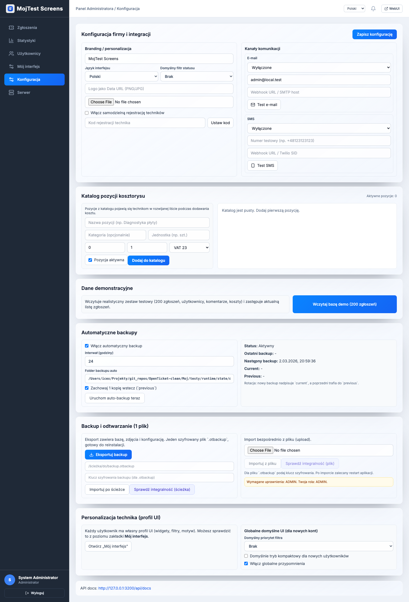

# OpenTicket
<!-- INSTALLER_LINK:START -->
## Installers (macOS + Windows)
- macOS PKG (latest): [OpenTicket-Installer.pkg](https://github.com/damianx9x/OpenTicket/releases/latest/download/OpenTicket-Installer.pkg)
- macOS PKG (v0.4.1): [OpenTicket-Installer.pkg](https://github.com/damianx9x/OpenTicket/releases/download/v0.4.1/OpenTicket-Installer.pkg)
- Windows EXE (latest): [OpenTicket-Installer.exe](https://github.com/damianx9x/OpenTicket/releases/latest/download/OpenTicket-Installer.exe)
- Windows EXE (v0.4.1): [OpenTicket-Installer.exe](https://github.com/damianx9x/OpenTicket/releases/download/v0.4.1/OpenTicket-Installer.exe)
<!-- INSTALLER_LINK:END -->

OpenTicket to nowoczesny system ticketowy dla serwisów elektroniki, zaprojektowany pod realną pracę warsztatową: szybkie przyjęcie sprzętu, pełna historia klienta, statusy etapów, koszty, zdjęcia, backup i odzyskiwanie.

## Milestone 0.41 (v0.4.1)
Wersja stabilizująca produkt przed wydaniami produkcyjnymi:
- pełna walidacja regresji i scenariuszy live (`16/16 PASS` + `3/3 PASS`),
- gotowe instalatory macOS (`.pkg`, `.dmg`) i Windows (`.exe`) dla tej wersji,
- odświeżone screenshoty release,
- poprawiona jakość dokumentacji i procesu wydawniczego,
- zachowany tryb lokalny + tryb serwera zdalnego (Linux/Synology) bez regresji.

## Dlaczego OpenTicket
- **Szybki onboarding**: kreator setup prowadzi użytkownika krok po kroku.
- **Odporność operacyjna**: reset, diagnostyka, backup, restore, watchdog backendu.
- **Desktop + WebUI**: jedno spójne doświadczenie dla macOS/Windows i przeglądarki.
- **Praca lokalna i zdalna**: `server_client`, `client_only`, `remote host`.
- **Bezpieczeństwo i audyt**: tokenowany setup zdalny, szyfrowane backupy, raporty testowe.

## Kluczowe możliwości
- Workflow zgłoszeń z etapami (m.in. przyjęcie, diagnoza, kosztorys, realizacja, zamknięcie/reopen).
- Przypisanie technika + filtry operacyjne (`Tylko moje`, `> X dni`, statusy, priorytet, kanał, daty).
- Zapisywalne presety filtrów użytkownika (szybkie przełączanie na dashboardzie).
- Konfiguracja firmy: branding, logo, kanały komunikacji, ustawienia operatorów.
- Backup `.otbackup` (AES-256-GCM) + klucz odzyskiwania + walidacja integralności.
- Auto-backup z rotacją (`current` + `previous`) i harmonogramem.
- Import/restore w setupie: istniejąca baza, backup szyfrowany, dataset demo.
- Narzędzia serwisowe admina: status silnika, restart, szybka naprawa, raport diagnostyczny.

## Architektura
- `backend/` — NestJS + Prisma + SQLite, API `v1`, auth, tickets, backup, demo seed.
- `frontend/` — Next.js WebUI (setup, login, dashboard, statystyki, użytkownicy, konfiguracja).
- `desktop/` — Electron (watchdog backendu, updater, IPC bridge).
- `deploy/` — profile remote host (Docker Linux/Synology + native systemd).
- `Moj/` — oficjalny build instalatorów/deinstalatora + testy E2E.

## Screenshoty (v0.4.1)
- Dashboard: `docs/screenshots/v0.4.1/dashboard-chromium.png`
- Dashboard (Cupertino): `docs/screenshots/v0.4.1/dashboard-cupertino-chromium.png`
- Modal zgłoszenia: `docs/screenshots/v0.4.1/ticket-modal-chromium.png`
- Statystyki: `docs/screenshots/v0.4.1/statistics-chromium.png`
- Użytkownicy: `docs/screenshots/v0.4.1/users-chromium.png`
- Konfiguracja: `docs/screenshots/v0.4.1/settings-chromium.png`
- Serwer/diagnostyka: `docs/screenshots/v0.4.1/server-chromium.png`






## Szybki start (DEV)
```bash
make test
./Moj/testy/smoke.sh
./Moj/testy/auth-smoke.sh
./Moj/testy/live-3-suite.sh
```

## Build i publikacja
```bash
./Moj/build-oficjalna-instalka.sh
./Moj/build-oficjalna-instalka-win.sh
./Moj/publish-release.sh
```

Artefakty:
- `Moj/OpenTicket-Installer.pkg`
- `Moj/OpenTicket-Uninstaller.pkg`
- `Moj/OpenTicket-Installer.dmg`
- `Moj/OpenTicket-Installer.exe`
- `Moj/OpenTicket-Portable.exe`
- `Moj/latest-mac.yml`, `Moj/latest.yml`

## Tryb zdalny (Remote Host)
OpenTicket wspiera wdrożenie serwera poza komputerem użytkownika końcowego:
- Linux Docker: `deploy/docker/install.sh`
- Linux native systemd: `deploy/native/install.sh`
- Synology Docker profile

Dokumentacja:
- `docs/REMOTE_INSTALL_LINUX.md`
- `docs/REMOTE_INSTALL_SYNOLOGY.md`
- `docs/REMOTE_INSTALL_NATIVE_SYSTEMD.md`

## Jakość i testy
Ostatnia walidacja release (v0.4.1):
- pełna regresja: `docs/test-reports/full-regression-20260301-203414/SUMMARY.md` (`16/16 PASS`),
- testy live: `docs/test-reports/live-3-20260301-205513/SUMMARY.md` (`3/3 PASS`),
- losowe testy UI Chromium/WebKit: PASS,
- test integralności backupu: PASS,
- test klient↔serwer: PASS.

## Security
- plan testów: `docs/SECURITY_TEST_PLAN.md`
- raport bezpieczeństwa: `docs/SECURITY_AGENT_REPORT_2026-02-27.md`
- audyt zależności: `docs/DEPENDENCY_DEEP_CHECK_2026-02-28.md`

## Changelog
Pełna lista zmian milestone: `CHANGELOG.md`.
