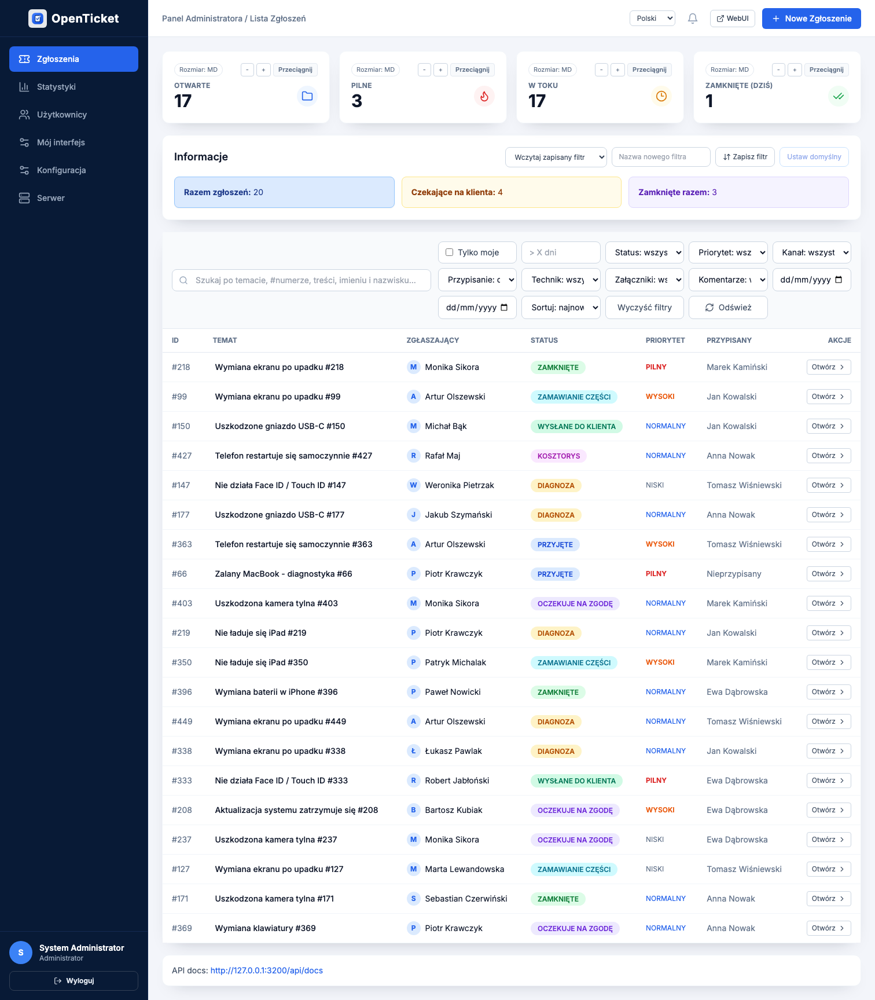
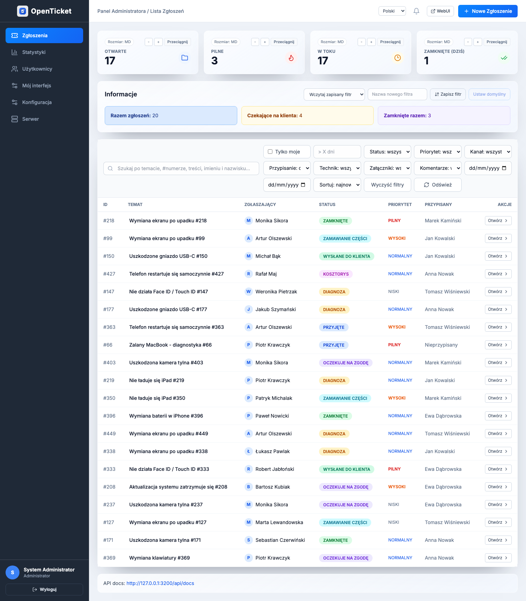
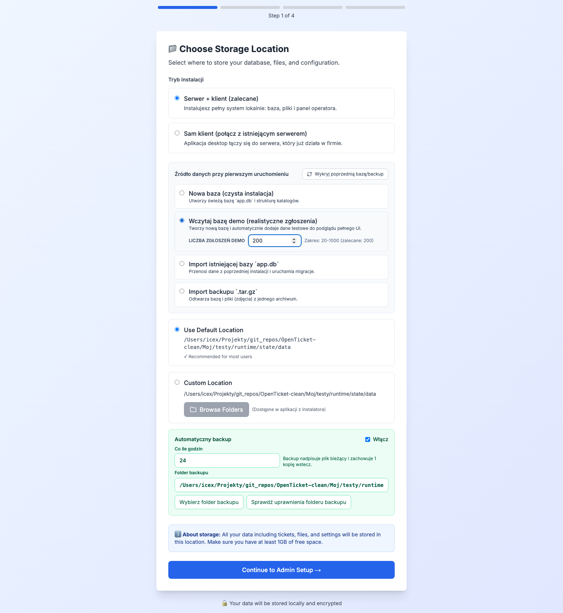
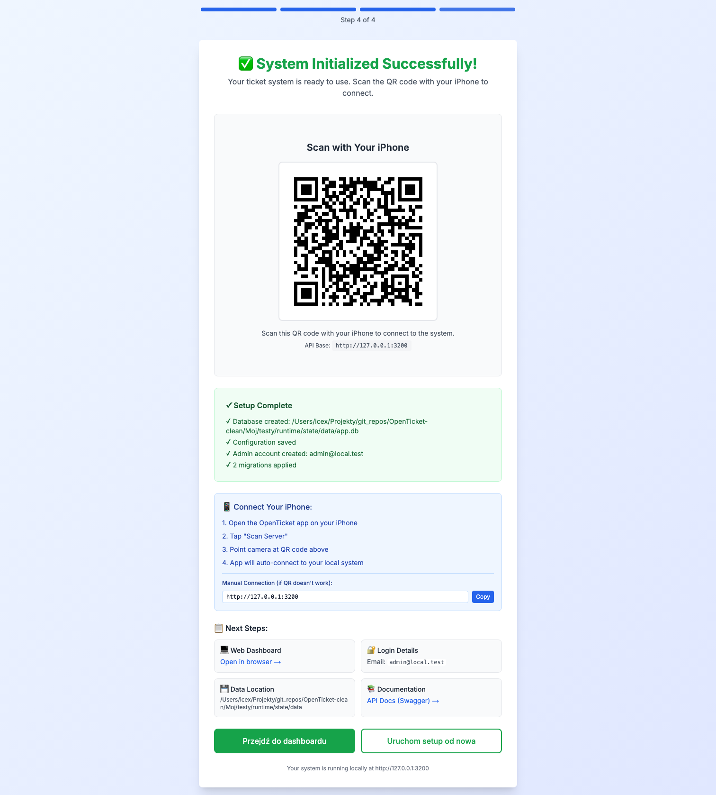
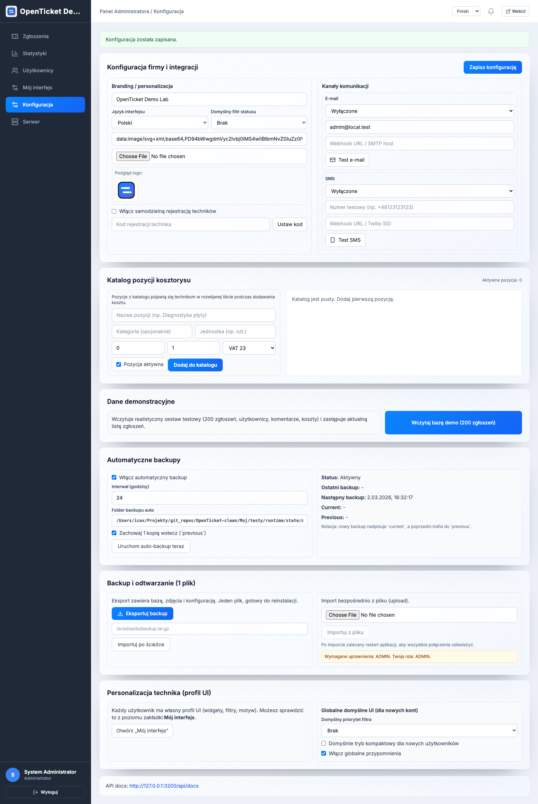
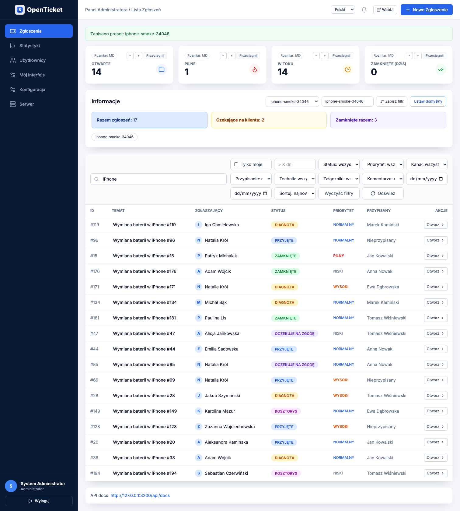

# OpenTicket
<!-- INSTALLER_LINK:START -->
## Installers (macOS + Windows)
- macOS PKG (latest): [OpenTicket-Installer.pkg](https://github.com/damianx9x/OpenTicket/releases/latest/download/OpenTicket-Installer.pkg)
- macOS PKG (v0.4.0): [OpenTicket-Installer.pkg](https://github.com/damianx9x/OpenTicket/releases/download/v0.4.0/OpenTicket-Installer.pkg)
- Windows EXE (latest): [OpenTicket-Installer.exe](https://github.com/damianx9x/OpenTicket/releases/latest/download/OpenTicket-Installer.exe)
- Windows EXE (v0.4.0): [OpenTicket-Installer.exe](https://github.com/damianx9x/OpenTicket/releases/download/v0.4.0/OpenTicket-Installer.exe)
<!-- INSTALLER_LINK:END -->

OpenTicket to lokalny system ticketowy dla serwisów elektroniki: backend + WebUI + aplikacja desktop (macOS/Windows), z naciskiem na stabilną pracę offline w warsztacie.

## Zakres produktu
- Lokalny silnik (NestJS + Prisma + SQLite).
- WebUI operatora (Next.js) osadzane również w desktop app.
- Instalatory klientowe (`.pkg`, `.exe`) i kompletna deinstalacja.
- Setup wizard: czysta baza / import `app.db` / import backupu `.tar.gz` / seed bazy demo (500).
- Konfiguracja auto-backupu już w setupie (folder + interwał, rotacja `current` + `previous`).
- Backup i restore (baza + uploady + konfiguracja).
- Diagnostyka serwera, restart silnika, szybka naprawa i raport JSON.
- Aktualizacje aplikacji z fallbackiem GitHub Releases.

## Architektura
- `backend/` — API `v1`, auth, tickets, attachments, reminders, backup, demo seed.
- `frontend/` — UI setup/login/dashboard/statystyki/użytkownicy/konfiguracja.
- `desktop/` — Electron wrapper, watchdog backendu, updater, bridge IPC.
- `Moj/` — oficjalne buildy instalatorów, deinstalator i testy E2E.

## Quickstart (DEV)
```bash
cd /Users/icex/Projekty/git_repos/OpenTicket-clean
./Moj/testy/start.sh --fresh --no-open
./Moj/testy/smoke.sh
./Moj/testy/auth-smoke.sh
./Moj/testy/ui-random-10.sh --all-browsers
```

## Build instalatorów
```bash
cd /Users/icex/Projekty/git_repos/OpenTicket-clean
./Moj/build-oficjalna-instalka.sh
# Windows (w odpowiednim środowisku)
./Moj/build-oficjalna-instalka-win.sh
```

Po buildzie:
- `Moj/OpenTicket-Installer.pkg`
- `Moj/OpenTicket-Uninstaller.pkg`
- `Moj/OpenTicket-Installer.dmg` (nośnik zawierający pliki `.pkg`)
- `Moj/OpenTicket-Installer.exe` (Windows)
- `Moj/latest-mac.yml` + `Moj/latest.yml` (metadane auto-update)

## Screenshoty UI (aktualne)
- Dashboard (demo): `docs/screenshots/v0.4/dashboard-chromium.png`
- Dashboard (Cupertino Glass): `docs/screenshots/v0.4/dashboard-cupertino-chromium.png`
- Dashboard (theme: Graphite): `docs/screenshots/v0.4/dashboard-theme-graphite.png`
- Dashboard (theme: Emerald): `docs/screenshots/v0.4/dashboard-theme-emerald.png`
- Dashboard (theme: Cupertino): `docs/screenshots/v0.4/dashboard-theme-cupertino.png`
- Dashboard (demo po setup): `docs/screenshots/v0.4/dashboard-demo-helpdesk.png`
- Setup krok 1 (demo dataset): `docs/screenshots/v0.4/setup-step1-demo.png`
- Setup krok 2 (admin): `docs/screenshots/v0.4/setup-step2-admin.png`
- Setup krok 3 (review/init): `docs/screenshots/v0.4/setup-step3-review.png`
- Setup krok 4 (complete): `docs/screenshots/v0.4/setup-step4-complete.png`
- Ticket modal: `docs/screenshots/v0.4/ticket-modal-chromium.png`
- Statystyki: `docs/screenshots/v0.4/statistics-chromium.png`
- Użytkownicy: `docs/screenshots/v0.4/users-chromium.png`
- Konfiguracja: `docs/screenshots/v0.4/settings-chromium.png`
- Konfiguracja (logo custom): `docs/screenshots/v0.4/settings-logo-custom.png`
- Presety filtrów: `docs/screenshots/v0.4/dashboard-filters-preset.png`
- Serwer/diagnostyka: `docs/screenshots/v0.4/server-chromium.png`
- Serwer po świeżej instalacji: `docs/screenshots/v0.4/server-status-after-install.png`










## Status (v0.4.0)
Zrobione:
- setup wizard: dodany wariant „baza demo” przy pierwszej konfiguracji,
- deinstalator: rozszerzone czyszczenie legacy i custom data paths,
- installer DMG: przebudowany na nośnik `.pkg` (koniec z uruchamianiem app bez instalacji do `/Applications`),
- auto-update: fallback do GitHub Releases, gdy release nie ma `latest-mac.yml` / `latest.yml`,
- normalizacja `userData` do `~/Library/Application Support/OpenTicket` z migracją legacy,
- nowy motyw dashboardu: `Cupertino Glass Pro` (Apple-inspired),
- deep dependency check: `./scripts/dependency-deep-check.sh` (audit + outdated + transitive summary),
- pełny test flow instalacji i użycia: setup demo (500) + motywy + logo + filtry + backup + security.
- auto-backup: harmonogram i folder konfigurowane w setupie + panelu admina, rotacja 1 kopii wstecz.
- nowy scenariusz E2E: klient desktop łączy się do osobnej instancji serwera i pracuje na tych samych danych.
- pełna migracja UI: usunięte legacy `frontend/strona-test` i duplikat `frontend/page.tsx`.
- „Moje filtry”: domknięte presety (save/apply/rename/delete + preset domyślny i szybkie przełączanie).
- CI smoke: dodany test „clean user account” na macOS i Windows.
- pipeline release na tagu: publikacja assetów updatera przez `gh release` + walidacja `latest-mac.yml` / `latest.yml`.

## Pełna deinstalacja (macOS)
Wersja kompletna (usuwa app + dane + cache + launch agents + receipts):
```bash
sudo "/Library/Application Support/OpenTicket/uninstall-openticket.sh" --yes
```

Fallback z repo:
```bash
cd /Users/icex/Projekty/git_repos/OpenTicket-clean
sudo ./scripts/uninstall-ticket-system.sh --yes
```

Uwaga:
- bez `sudo` nie da się usunąć plików root w `/Applications` i `/Library`.
- po deinstalacji instalacja startuje od czystego setupu.

## Pełny test E2E (instalacja + użycie)
```bash
cd /Users/icex/Projekty/git_repos/OpenTicket-clean
./Moj/testy/full-install-usage-smoke.sh
node ./scripts/ci/clean-user-account-smoke.mjs --platform=macos
```

Co waliduje:
- setup wizard z opcją demo dataset (500 zgłoszeń przy generacji screenshotów, 200 w regresji runtime),
- przejście do dashboardu po setupie,
- zapis i przełączanie presetów filtrów,
- zmianę 3 motywów (`graphite`, `emerald`, `cupertino`),
- upload logo firmy i zapis konfiguracji,
- otwarcie zakładki serwera i diagnostyki.

## Matryca regresji (zarchiwizowana)
Pełny przebieg 15 kroków:
- `docs/test-reports/full-regression-20260301-163146/SUMMARY.md`

Zawiera:
- log per krok (setup, auth, import, backup, auto-backup, klient↔serwer, random-ui, print, security, dependency, 10x fresh),
- raporty JSON/MD z każdego testu,
- wynik końcowy: `PASS`.

## TODO (najbliższe kroki)
1. Rozpocząć etap iOS: pairing + ticket create + upload zdjęć + QR scan flow.
2. Dodać test upgrade: poprzednia wersja -> update -> zachowanie danych i backup rollback.
3. Rozszerzyć politykę release o automatyczny changelog z commitów.
4. Dodać e2e PDF/statistics export test do macOS + Windows matrix.

## Diagnostyka i reset
```bash
# runtime tests
./Moj/testy/diagnose.sh

# security baseline check (dependency audit + build + risky pattern scan)
./scripts/security-check.sh

# deep dependency check (audit + outdated + transitive chains)
./scripts/dependency-deep-check.sh

# stop / reset środowiska testowego
./Moj/testy/stop.sh
APP_ENV=DEV_LOCAL ./Moj/testy/reset.sh

# deinstalacja systemowa
./Moj/deinstaluj-openticket.sh --yes
```

## Polityka release
- Każda wersja jest tagowana semver (`v0.x.y`).
- Release zawiera zawsze: installer, uninstaller i metadane updatera (`latest-mac.yml`, `latest.yml`).
- Linki do instalatorów są aktualizowane automatycznie w tym README.

## Security
- Raport wdrożeń bezpieczeństwa: `docs/SECURITY_AGENT_REPORT_2026-02-27.md`
- Plan testów security: `docs/SECURITY_TEST_PLAN.md`
- Głęboki audyt zależności (runtime + transitive): `docs/DEPENDENCY_DEEP_CHECK_2026-02-28.md`
