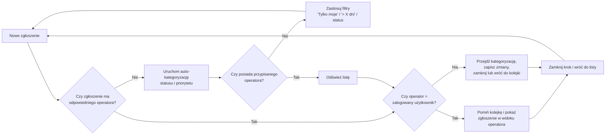

# Operator Flow (przydział + filtry)

Poniższy flow jest wdrożony jako logika operacyjna dashboardu i służy do szybkiej triage zgłoszeń bez ręcznego „klikania w ciemno”.

## Reguły UX
- Operator zawsze widzi priorytetowe zgłoszenia na górze.
- Filtr „Tylko moje” i preset filtrów skracają czas obsługi.
- Zmiany statusu zapisują historię etapów i wspierają reopen.
